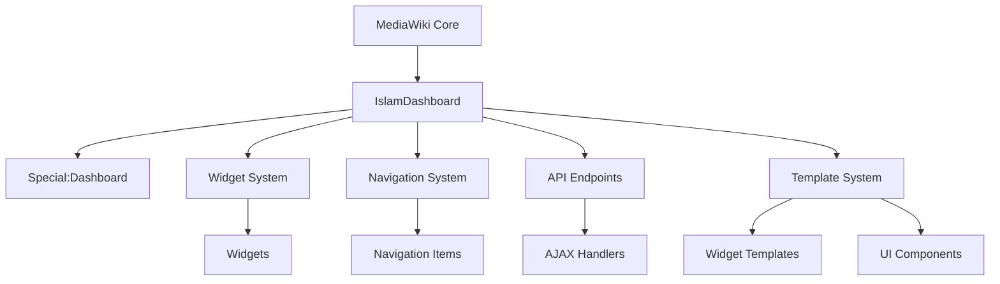

# IslamDashboard Architecture

## Overview

The IslamDashboard extension provides a highly customizable and extensible user dashboard for MediaWiki, designed to work seamlessly with the Islam Skin. It follows a modular architecture with a clear separation of concerns, making it easy to extend and maintain. The system is built with performance, accessibility, and user experience in mind.

## System Architecture

### High-Level Architecture



## Core Components

### 1. SpecialDashboard
**Location**: `includes/SpecialDashboard.php`  
**Purpose**: Main entry point for the dashboard interface.  
**Key Responsibilities**:
- Renders the complete dashboard UI
- Manages user interactions and widget lifecycle
- Coordinates between widgets, navigation, and the core system
- Handles AJAX requests for widget updates
- Manages user preferences and layout persistence
- Implements the SpecialPage interface for MediaWiki integration

### 2. Widget System
**Location**: `includes/Widgets/`  
**Purpose**: Provides a framework for creating and managing dashboard widgets.  
**Key Components**:

#### 2.1. DashboardWidget (Abstract Base Class)
- **Location**: `includes/Widgets/DashboardWidget.php`
- **Key Features**:
  - Implements core widget functionality
  - Handles template rendering with variable replacement
  - Manages widget state and persistence
  - Provides utility methods for common operations
  - Handles widget configuration and settings

#### 2.2. Built-in Widgets
- **WelcomeWidget**: Displays personalized welcome message and user stats
- **RecentActivityWidget**: Shows recent user activity and site updates
- **QuickActionsWidget**: Provides quick access to common actions
- **CustomWidget**: Base for creating custom widgets

### 3. Navigation System
**Location**: `includes/Navigation/`  
**Purpose**: Manages the dashboard's hierarchical navigation structure.  

#### 3.1. NavigationManager
- **Location**: `includes/Navigation/NavigationManager.php`
- **Key Features**:
  - Singleton pattern for global access
  - Manages navigation sections and items
  - Handles permission-based filtering
  - Persists user preferences
  - Provides methods for dynamic navigation updates

#### 3.2. NavigationRenderer
- **Location**: `includes/Navigation/NavigationRenderer.php`
- **Key Features**:
  - Renders navigation HTML
  - Handles responsive behavior
  - Implements accessibility features
  - Supports theming through CSS variables

#### 3.3. NavigationItem
- **Location**: `includes/Navigation/NavigationItem.php`
- **Key Features**:
  - Represents a single navigation item
  - Handles URL generation
  - Manages active state
  - Supports hierarchical navigation

### 4. Template System
**Location**: `templates/` and `templates/widgets/`  
**Purpose**: Provides a lightweight template system for rendering UI components.  

#### 4.1. Template Structure
- **Widget Templates**: `templates/widgets/`
- **Layout Templates**: `templates/layout/`
- **Component Templates**: `templates/components/`

#### 4.2. Key Features
- Simple variable replacement syntax
- Support for conditional rendering
- Template inheritance
- Organized file structure
- Automatic template loading

### 5. WidgetManager
**Location**: `includes/WidgetManager.php`  
**Purpose**: Central registry and manager for all dashboard widgets.  
**Key Features**:
- Widget registration and discovery
- Layout management and persistence
- User preference handling
- Widget instance management

### 6. Hooks
**Location**: `Hooks.php`  
**Purpose**: Handles MediaWiki hook registrations and callbacks.  
**Key Hooks**:
- `BeforePageDisplay`: Injects dashboard CSS/JS
- `SkinTemplateNavigation`: Adds dashboard to site navigation
- `GetPreferences`: Adds dashboard-specific user preferences
- `LoadExtensionSchemaUpdates`: Handles database schema updates
- `ResourceLoaderGetConfigVars`: Provides configuration to client-side code

## Data Flow

1. **Initialization**:
   - Extension loads and registers hooks
   - Widgets are registered with WidgetManager
   - Navigation structure is built
   - Resources are registered with ResourceLoader
   - Database tables are created/updated if needed

2. **Page Load**:
   - User requests the dashboard
   - SpecialDashboard initializes
   - User preferences and layout are loaded
   - Navigation is rendered based on user permissions
   - Widgets are instantiated and rendered
   - Client-side JavaScript initializes interactive components

3. **Widget Interaction**:
   - User interacts with a widget (e.g., clicks refresh)
   - JavaScript handles the interaction
   - AJAX request is sent to the server
   - Widget processes the request and returns updated content
   - UI is updated with the new content

## Template System

The template system provides a simple way to separate HTML structure from PHP logic. It uses a basic variable replacement syntax:

```html
<div class="widget {{widgetClass}}">
    <h3>{{title}}</h3>
    <div class="content">
        {{#hasContent}}
            {{content}}
        {{/hasContent}}
        {{^hasContent}}
            <p>No content available</p>
        {{/hasContent}}
    </div>
</div>
```

## JavaScript Architecture

The client-side code is organized into modules:

- `ext.islamDashboard.core.js`: Core functionality and utilities
- `ext.islamDashboard.navigation.js`: Navigation menu behavior
- `ext.islamDashboard.widgets.js`: Widget management and interactions
- `ext.islamDashboard.grid.js`: Dashboard layout management

## Security Considerations

- All user input is properly escaped before rendering
- Widget content is sanitized to prevent XSS attacks
- Database queries use prepared statements
- User permissions are checked before processing sensitive actions
- CSRF protection is implemented for all form submissions

## Performance Considerations

- Widget content is lazy-loaded when possible
- JavaScript and CSS are minified and combined
- Database queries are optimized and cached
- Expensive operations are performed asynchronously
- ResourceLoader is used for efficient asset loading

## Extension Points

The extension provides several ways to extend its functionality:

1. **Widgets**: Create custom widgets by extending the DashboardWidget class
2. **Navigation**: Add custom navigation items via the NavigationManager
3. **Hooks**: Use provided hooks to modify behavior
4. **Templates**: Override or extend the default templates
5. **API**: Use the provided API endpoints for custom integrations

## Dependencies

- MediaWiki 1.43+
- PHP 7.4+
- JavaScript (ES6+)
- jQuery (provided by MediaWiki)
- OOUI (provided by MediaWiki)
   - WidgetManager loads user's widget layout
   - Widgets are rendered in their respective positions

3. **User Interaction**:
   - AJAX calls handle widget updates
   - WidgetManager saves layout changes
   - UI updates to reflect changes

## Dependencies

- MediaWiki Core (1.43+)
- Codex (for UI components)
- OOUI (for interface elements)

## Extension Points

### Adding New Widgets
1. Create a new class in `includes/Widgets/`
2. Extend `DashboardWidget`
3. Implement required methods
4. Register the widget in `extension.json`

### Theming
- CSS variables for theming
- Responsive design breakpoints
- Dark mode support

## Performance Considerations

- Widgets are lazy-loaded
- Caching strategies for widget data
- Minimal JavaScript footprint

## Security

- CSRF protection for all write operations
- Proper permission checks
- Input validation and output escaping

See also: [API Reference](./API_REFERENCE.md) | [Widget Development](./WIDGETS.md)
