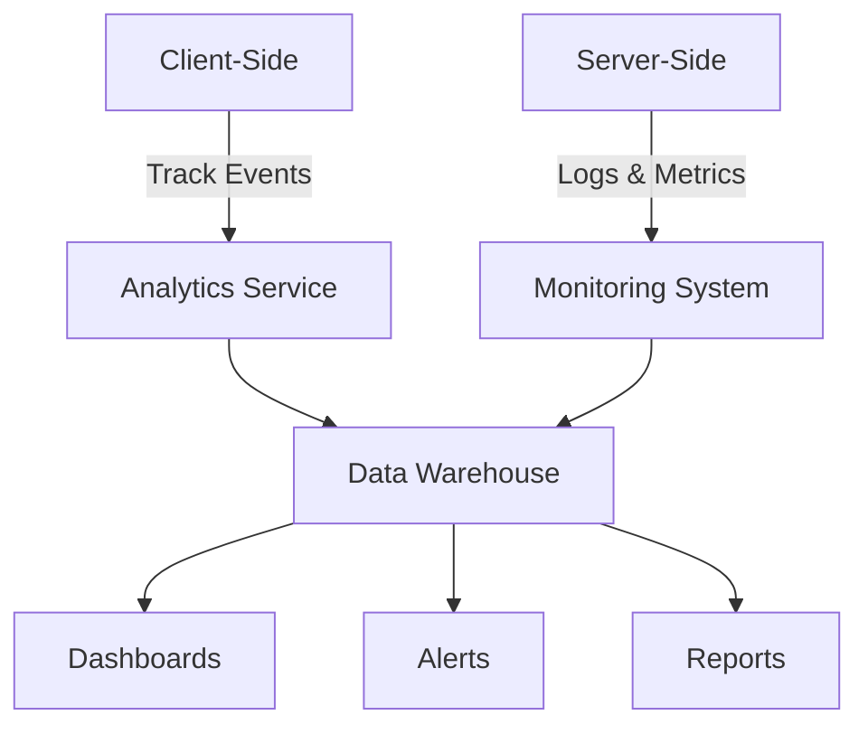

# Analytics & Monitoring

## Version: 0.3.1

## Table of Contents
1. [Overview](#overview)
2. [Key Metrics](#key-metrics)
3. [Implementation](#implementation)
4. [Dashboard Metrics](#dashboard-metrics)
5. [Real-time Monitoring](#real-time-monitoring)
6. [Alerting](#alerting)
7. [Logging Strategy](#logging-strategy)
8. [Privacy Considerations](#privacy-considerations)
9. [Tools & Integrations](#tools--integrations)
10. [Maintenance](#maintenance)

## Overview

### Purpose
Track and analyze user interactions, system performance, and business metrics to ensure optimal dashboard performance and user experience.

### Data Flow


## Key Metrics

### User Metrics
- **Active Users**: DAU, WAU, MAU
- **Engagement**: Session duration, pages per session
- **Retention**: User return rates
- **Feature Usage**: Widget interactions, feature adoption

### Performance Metrics
- **Page Load Time**: Time to interactive, First Contentful Paint
- **API Response Times**: P50, P95, P99
- **Error Rates**: 4xx, 5xx errors
- **Resource Usage**: CPU, memory, database queries

### Business Metrics
- **Conversion Rates**: Sign-ups, feature adoption
- **Retention**: User churn rate
- **Monetization**: Revenue per user, conversion funnels

## Implementation

### Client-Side Tracking
```javascript
// analytics.js
class Analytics {
  static init() {
    this.initializeProviders();
    this.trackPageView();
    this.setupErrorTracking();
  }

  static trackEvent(category, action, label, value) {
    const event = { category, action, label, value, timestamp: new Date().toISOString() };
    
    // Send to analytics providers
    if (window.gtag) {
      gtag('event', action, { 'event_category': category, 'event_label': label, 'value': value });
    }
    
    // Send to internal analytics
    this.sendToBackend('/api/analytics/event', event);
    
    // Log for debugging
    console.debug('[Analytics]', event);
  }
  
  static trackPageView(path = window.location.pathname) {
    this.trackEvent('page', 'view', path);
  }
  
  static setupErrorTracking() {
    window.addEventListener('error', (event) => {
      this.trackEvent('error', 'unhandled', event.message, 1);
    });
    
    window.addEventListener('unhandledrejection', (event) => {
      this.trackEvent('error', 'unhandled-rejection', event.reason, 1);
    });
  }
  
  static async sendToBackend(endpoint, data) {
    try {
      await fetch(endpoint, {
        method: 'POST',
        headers: { 'Content-Type': 'application/json' },
        body: JSON.stringify(data)
      });
    } catch (error) {
      console.error('Failed to send analytics:', error);
    }
  }
}

// Initialize on page load
if (document.readyState === 'loading') {
  document.addEventListener('DOMContentLoaded', () => Analytics.init());
} else {
  Analytics.init();
}
```

### Server-Side Tracking
```php
// In MediaWiki hook handler
$wgHooks['BeforePageDisplay'][] = function ( OutputPage $out, Skin $skin ) {
    // Add analytics script
    $out->addModules( 'ext.islamdashboard.analytics' );
    
    // Track page view in server logs
    $context = [
        'page_title' => $out->getTitle()->getPrefixedText(),
        'namespace' => $out->getTitle()->getNamespace(),
        'user_id' => $skin->getUser()->getId(),
        'is_https' => $out->getRequest()->getProtocol() === 'https',
        'user_agent' => $out->getRequest()->getHeader( 'User-Agent' ),
        'referrer' => $out->getRequest()->getHeader( 'Referer' ),
    ];
    
    wfDebugLog( 'pageview', json_encode( $context ) );
    return true;
};
```

## Dashboard Metrics

### User Engagement
```sql
-- Active Users
SELECT 
    DATE(timestamp) AS date,
    COUNT(DISTINCT user_id) AS active_users
FROM analytics_events
WHERE 
    timestamp >= DATE_SUB(NOW(), INTERVAL 30 DAY)
    AND event_name = 'page_view'
GROUP BY DATE(timestamp)
ORDER BY date DESC;
```

### Performance Metrics
```sql
-- API Performance
SELECT
    endpoint,
    COUNT(*) AS request_count,
    AVG(response_time_ms) AS avg_response_time,
    PERCENTILE_CONT(0.95) WITHIN GROUP (ORDER BY response_time_ms) AS p95_response_time,
    SUM(CASE WHEN status_code >= 400 THEN 1 ELSE 0 END) AS error_count
FROM api_metrics
WHERE 
    timestamp >= DATE_SUB(NOW(), INTERVAL 1 DAY)
GROUP BY endpoint
ORDER BY avg_response_time DESC;
```

## Real-time Monitoring

### WebSocket Updates
```javascript
const socket = new WebSocket('wss://monitor.muslim.wiki/realtime');

socket.onmessage = (event) => {
  const data = JSON.parse(event.data);
  
  switch (data.type) {
    case 'error':
      showErrorAlert(data.message);
      break;
    case 'performance':
      updatePerformanceMetrics(data.metrics);
      break;
    case 'user_activity':
      updateActiveUsers(data.count);
      break;
  }
};
```

### Server Health
```yaml
# Prometheus metrics example
# HELP http_requests_total Total number of HTTP requests
# TYPE http_requests_total counter
http_requests_total{method="GET",status="200"} 1027
http_requests_total{method="POST",status="200"} 348
http_requests_total{method="POST",status="400"} 12

# HELP http_request_duration_seconds HTTP request duration in seconds
# TYPE http_request_duration_seconds histogram
http_request_duration_seconds_bucket{le="0.1"} 1234
http_request_duration_seconds_bucket{le="0.5"} 2345
http_request_duration_seconds_bucket{le="1"} 3000
```

## Alerting

### Alert Rules
```yaml
groups:
- name: example
  rules:
  - alert: HighErrorRate
    expr: rate(http_requests_total{status=~"5.."}[5m]) / rate(http_requests_total[5m]) > 0.01
    for: 10m
    labels:
      severity: critical
    annotations:
      summary: "High error rate on {{ $labels.instance }}"
      description: "Error rate is {{ $value }}% for {{ $labels.path }}"

  - alert: ServiceDown
    expr: up == 0
    for: 5m
    labels:
      severity: critical
    annotations:
      summary: "Service {{ $labels.instance }} is down"
```

### Notification Channels
- **Email**: For non-critical alerts
- **Slack**: For team notifications
- **PagerDuty**: For critical incidents
- **SMS**: For on-call engineers

## Logging Strategy

### Log Levels
| Level | When to Use |
|-------|-------------|
| ERROR | System is in a critical state |
| WARN | Unexpected but handled condition |
| INFO | Normal operational messages |
| DEBUG | Detailed debugging information |
| TRACE | Very detailed debugging information |

### Log Rotation
```bash
# Logrotate configuration for analytics logs
/var/log/islam-dashboard/*.log {
    daily
    rotate 30
    compress
    delaycompress
    missingok
    notifempty
    create 0640 www-data www-data
    sharedscripts
    postrotate
        kill -USR1 `cat /var/run/nginx.pid`
    endscript
}
```

## Privacy Considerations

### Data Minimization
- Collect only necessary data
- Anonymize IP addresses
- Respect Do Not Track headers
- Implement data retention policies

### User Controls
```javascript
// Check user preferences
if (userPreferences.analyticsEnabled) {
  Analytics.init();
}

// Opt-out function
function optOutOfAnalytics() {
  localStorage.setItem('analyticsOptOut', 'true');
  // Clear existing analytics data
  // ...
}
```

## Tools & Integrations

### Recommended Stack
- **Analytics**: Google Analytics, Matomo
- **Monitoring**: Prometheus, Grafana
- **Logging**: ELK Stack, Graylog
- **APM**: New Relic, Datadog
- **Error Tracking**: Sentry, Rollbar

### Integration Example
```javascript
// Sentry initialization
import * as Sentry from '@sentry/browser';

Sentry.init({
  dsn: 'YOUR_DSN',
  environment: process.env.NODE_ENV,
  release: process.env.APP_VERSION,
  tracesSampleRate: 1.0,
  beforeSend(event) {
    // Filter out sensitive data
    if (event.user) {
      delete event.user.ip_address;
    }
    return event;
  }
});
```

## Maintenance

### Data Retention
| Data Type | Retention Period |
|-----------|------------------|
| Raw Events | 30 days |
| Aggregated Metrics | 13 months |
| Error Logs | 90 days |
| Audit Logs | 1 year |

### Regular Reviews
- Weekly: Check error rates and performance
- Monthly: Review analytics dashboards
- Quarterly: Audit data collection practices
- Annually: Review retention policies

## Version History
- **0.3.1**: Initial version
