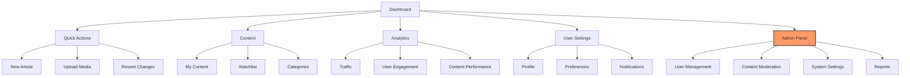

# Navigation and Access Control

## Version: 0.3.1

## 1. Dashboard Layout Overview

### 1.1 Main Navigation Structure (Inspired by ProWiki Admin)

#### Core Navigation Categories:
1. **Dashboard**
   - Overview
   - Activity Feed
   - Quick Stats

2. **Appearance**
   - Themes
   - Layout
   - Custom CSS/JS
   - Logo & Branding

3. **Content**
   - Pages
   - Categories
   - Files
   - Templates
   - Navigation

4. **Data**
   - Database Manager
   - Import/Export
   - Wikibase Integration
   - Cargo Tables
   - Semantic MediaWiki

5. **Editing**
   - Visual Editor
   - Source Editor
   - Bulk Operations
   - Revision Control

6. **Messaging**
   - Notifications
   - Announcements
   - User Messages
   - Email Templates

7. **Users**
   - User Management
   - Groups & Permissions
   - User Activity
   - Registration Settings

8. **Authentication**
   - Login Methods
   - OAuth
   - Two-Factor Auth
   - API Access

9. **Extensions**
   - Manage Extensions
   - Settings
   - Compatibility

10. **System**
    - Server Info
    - PHP Info
    - Caching
    - Maintenance

#### Visual Navigation Structure


### 1.2 Widget Areas
1. **Header Bar**
   - User menu
   - Quick search
   - Notifications
   - Language selector

2. **Main Content Area**
   - Customizable widget grid
   - Context-aware widgets based on user role
   - Drag-and-drop organization

3. **Sidebar**
   - Navigation menu
   - Quick access tools
   - Contextual help

## 2. Role-Based Access Control

### 2.1 User Roles and Permissions

| Feature/Widget | Guest | Registered User | Content Editor | Administrator |
|----------------|-------|-----------------|----------------|---------------|
| View Dashboard | ✓     | ✓              | ✓             | ✓            |
| Customize Layout | ✗    | ✓              | ✓             | ✓            |
| Create Content | ✗     | Limited        | ✓             | ✓            |
| Edit Content   | ✗     | Own content    | ✓             | ✓            |
| Delete Content | ✗     | ✗              | Own content    | ✓            |
| View Analytics | ✗     | Basic          | Extended       | Full         |
| User Management | ✗    | ✗              | ✗             | ✓            |
| System Settings | ✗    | ✗              | ✗             | ✓            |
| Content Moderation | ✗  | ✗              | Limited        | Full         |

### 2.2 Permission Implementation

#### 2.2.1 MediaWiki Permissions
```php
// In extension.json
"AvailableRights": [
    "view-dashboard",
    "edit-dashboard",
    "manage-widgets",
    "view-analytics",
    "manage-users",
    "manage-system"
],

"RightsRequired": {
    "special": {
        "IslamDashboard": "view-dashboard"
    },
    "actions": {
        "edit": "edit-dashboard",
        "manage-widgets": "manage-widgets",
        "view-analytics": "view-analytics",
        "manage-users": "manage-users",
        "manage-system": "manage-system"
    }
}
```

#### 2.2.2 Widget Visibility Control
```php
class WidgetManager {
    /**
     * Get available widgets for current user
     */
    public function getAvailableWidgets(User $user): array {
        $widgets = [];
        
        // Common widgets for all users
        $widgets[] = new WelcomeWidget();
        $widgets[] = new RecentActivityWidget();
        
        // Content management widgets
        if ($user->isAllowed('edit')) {
            $widgets[] = new QuickActionsWidget();
            $widgets[] = new MyContentWidget();
        }
        
        // Admin-only widgets
        if ($user->isAllowed('manage-system')) {
            $widgets[] = new SystemStatusWidget();
            $widgets[] = new UserManagementWidget();
        }
        
        return $widgets;
    }
}
```

## 3. Content Visibility Rules

### 3.1 Content Filtering
```php
class ContentFilter {
    public static function filterContent(array $content, User $user): array {
        return array_filter($content, function($item) use ($user) {
            // Check content visibility based on user permissions
            if (isset($item['visibility'])) {
                switch ($item['visibility']) {
                    case 'public':
                        return true;
                    case 'loggedin':
                        return $user->isRegistered();
                    case 'admin':
                        return $user->isAllowed('manage-system');
                    default:
                        return false;
                }
            }
            return true;
        });
    }
}
```

### 3.2 Menu Item Visibility
```javascript
// Client-side menu rendering
function renderMenuItems(menuItems, userPermissions) {
    return menuItems.filter(item => {
        if (!item.requiredPermission) return true;
        return userPermissions.includes(item.requiredPermission);
    });
}
```

## 4. User Experience

### 4.1 Role-Based Dashboard Views
- **Guests**: Limited view with public content and call-to-action for registration
- **Registered Users**: Full access to personal content and basic features
- **Editors**: Additional content management tools
- **Administrators**: Complete system access and management tools

### 4.2 Progressive Disclosure
- Show/hide advanced options based on user role
- Contextual help for admin features
- Confirmation dialogs for destructive actions

## 6. Enhanced Features & Future Considerations

### 6.1 ProWiki-Inspired Features
- **Advanced Content Management**: Bulk operations, template management
- **Data Integration**: Wikibase, Cargo, and Semantic MediaWiki support
- **Customization**: Theme and layout options
- **User Management**: Granular permission controls
- **System Tools**: Maintenance and monitoring utilities

### 6.2 Accessibility Enhancements
- **Screen Reader Support**: ARIA labels and roles
- **Keyboard Navigation**: Full keyboard operability
- **High Contrast Mode**: For better readability
- **Text Resizing**: Without breaking layout
- **Reduced Motion**: For users with motion sensitivity

### 6.3 Advanced Error Handling
- **Client-Side Validation**: Real-time feedback
- **Server-Side Validation**: Comprehensive input checking
- **Error Recovery**: Suggestions for common issues
- **Detailed Logging**: For debugging and auditing

### 6.4 Performance Optimizations
- **Lazy Loading**: For dashboard widgets
- **Asset Optimization**: Minification and bundling
- **Cache Management**: Intelligent caching strategies
- **Database Optimization**: Query optimization

## 7. Implementation Notes

### 5.1 Caching Strategy
- Cache role-based views separately
- Clear cache on permission changes
- Use ETags for efficient cache validation

### 5.2 Security Considerations
- Always verify permissions server-side
- Sanitize all user inputs
- Log permission-related actions
- Implement rate limiting for admin actions

## 8. Testing Plan

### 6.1 Test Cases
1. Verify menu items visibility per role
2. Test widget availability based on permissions
3. Validate content filtering rules
4. Test permission escalation attempts
5. Verify cache behavior with permission changes

### 6.2 Test Users
- Guest (not logged in)
- Regular user
- Content editor
- Administrator

## 9. Future Enhancements

### 9.1 Content Management
- **Version Control Integration**: Git integration for content
- **Content Scheduling**: Publish content at specific times
- **Content Approval Workflow**: Multi-step approval process

### 9.2 User Experience
- **Custom Dashboards**: User-created dashboards
- **Widget Marketplace**: For third-party widgets
- **Tutorial System**: Interactive guides

### 9.3 Integration
- **Single Sign-On (SSO)**: Enterprise authentication
- **API Gateway**: For external services
- **Webhooks**: For event-driven actions

### 9.4 Advanced Features
- **AI-Powered Suggestions**: Content and layout recommendations
- **A/B Testing**: For interface improvements
- **Analytics Dashboard**: Advanced reporting
- **Backup & Restore**: Comprehensive data management
1. Custom role creation
2. Granular permission controls
3. Audit logging for permission changes
4. Two-factor authentication for admin actions
