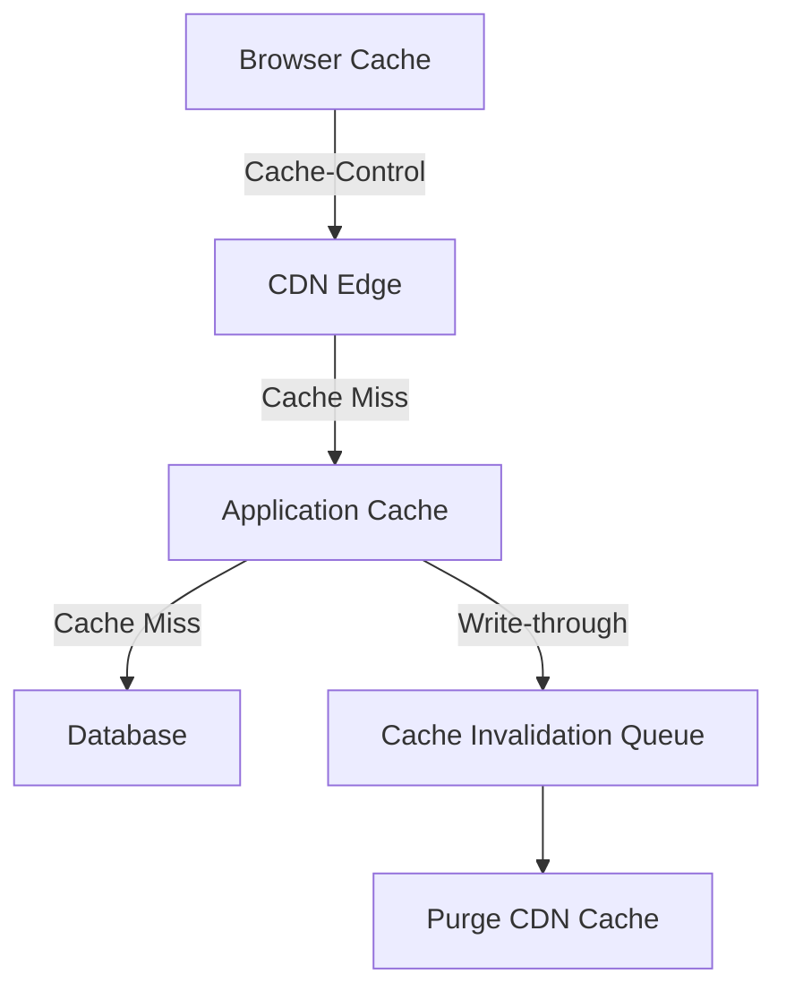

# Performance Optimization Guide

## Version: 0.3.1

## Table of Contents
1. [Frontend Optimization](#frontend-optimization)
2. [Backend Optimization](#backend-optimization)
3. [Database Optimization](#database-optimization)
4. [Caching Strategy](#caching-strategy)
5. [Asset Optimization](#asset-optimization)
6. [Monitoring and Metrics](#monitoring-and-metrics)
7. [Performance Testing](#performance-testing)

## Frontend Optimization

### Lazy Loading
```javascript
// Lazy load non-critical components
const LazyComponent = React.lazy(() => import('./HeavyComponent'));

function Dashboard() {
    return (
        <Suspense fallback={<LoadingSpinner />}>
            <LazyComponent />
        </Suspense>
    );
}
```

### Virtualized Lists
```javascript
import { FixedSizeList as List } from 'react-window';

function VirtualizedList({ items }) {
    return (
        <List
            height={400}
            itemCount={items.length}
            itemSize={35}
            width={300}
        >
            {({ index, style }) => (
                <div style={style}>
                    Item {items[index]}
                </div>
            )}
        </List>
    );
}
```

### Optimized Rendering
```javascript
// Use React.memo for pure components
const Widget = React.memo(function Widget({ data }) {
    return <div>{data}</div>;
}, (prevProps, nextProps) => {
    // Custom comparison function
    return prevProps.data.id === nextProps.data.id;
});
```

## Backend Optimization

### Query Optimization
```php
// Bad: N+1 query problem
foreach ($users as $user) {
    $posts = $db->select('posts', '*', ['user_id' => $user->id]);
    // Process posts
}

// Good: Single query with JOIN
$result = $db->select(
    ['u' => 'users'],
    ['u.*', 'p.*'],
    [],
    __METHOD__,
    [],
    ['p' => ['INNER JOIN', 'u.id = p.user_id']]
);
```

### Caching Strategy
```php
// Cache expensive operations
function getDashboardData(User $user) {
    $cache = MediaWikiServices::getInstance()->getMainWANObjectCache();
    $key = $cache->makeKey('dashboard-data', $user->getId());
    
    return $cache->getWithSetCallback(
        $key,
        $cache::TTL_HOUR,
        function () use ($user) {
            // Expensive operation
            return $this->calculateDashboardData($user);
        },
        ['version' => 2] // Bump version on schema changes
    );
}
```

## Database Optimization

### Indexing Strategy
```sql
-- Add indexes for frequently queried columns
ALTER TABLE /*_*/islamdashboard_widgets 
    ADD INDEX idx_user_widget (user_id, widget_id);

-- Covering index for common queries
CREATE INDEX idx_cover_example ON /*_*/table (col1, col2) 
    INCLUDE (col3, col4);
```

### Query Analysis
```sql
-- Check slow queries
SHOW FULL PROCESSLIST;

-- Analyze query execution plan
EXPLAIN 
SELECT * FROM /*_*/table WHERE condition;

-- Find unused indexes
SELECT * FROM sys.schema_unused_indexes 
WHERE object_schema = 'database_name';
```

## CDN Configuration

### 1. Content Delivery Network Setup
```nginx
# Nginx configuration for CDN
server {
    listen 80;
    server_name cdn.muslim.wiki;
    
    location /static/ {
        # Cache static assets for 1 year
        expires 1y;
        add_header Cache-Control "public, max-age=31536000, immutable";
        
        # Enable Gzip compression
        gzip on;
        gzip_types text/plain text/css application/json application/javascript;
        
        # Serve from local filesystem
        root /var/www/static;
        try_files $uri =404;
    }
    
    # Proxy dynamic content to application servers
    location / {
        proxy_pass http://app_servers;
        proxy_set_header Host $host;
        proxy_set_header X-Real-IP $remote_addr;
        
        # Cache dynamic content for 5 minutes
        proxy_cache my_cache;
        proxy_cache_valid 200 5m;
        proxy_cache_use_stale error timeout updating http_500 http_502 http_503 http_504;
    }
}
```

### 2. CDN Caching Rules

| Resource Type | Cache Duration | Cache-Control Headers |
|---------------|----------------|----------------------|
| Static Assets | 1 year | `public, max-age=31536000, immutable` |
| Media Files | 30 days | `public, max-age=2592000` |
| API Responses | 5 minutes | `public, max-age=300, s-maxage=300` |
| User Content | 1 hour | `public, max-age=3600, s-maxage=3600` |
| Private Data | 0 | `private, no-cache, no-store, must-revalidate` |

## Caching Strategy

### 1. Multi-layer Caching Architecture



### 2. Cache Invalidation Strategies

#### 2.1 Time-based Invalidation
```php
// Cache data for 1 hour with 10-minute stale-while-revalidate
$cache->set(
    $key,
    $data,
    3600, // TTL: 1 hour
    [
        'version' => $dataVersion,
        'staleTTL' => 600, // Serve stale for 10 minutes while revalidating
        'lockTSE' => 30, // Lock timeout for stampede protection
    ]
);
```

#### 2.2 Tag-based Invalidation
```php
// Store cache with tags
$cache->set(
    $key, 
    $data, 
    $ttl,
    ['tags' => ['user:' . $userId, 'widget:' . $widgetId]]
);

// Invalidate by tag
$cache->invalidateTags(['widget:' . $widgetId]);
```

### 3. Cache Warming

```php
// Pre-warm cache after deployment
function warmCache() {
    $popularWidgets = $this->getPopularWidgets();
    $cache = $this->getCache();
    
    foreach ($popularWidgets as $widget) {
        $key = $this->getCacheKey($widget);
        $data = $this->generateWidgetData($widget);
        $cache->set($key, $data, $this->getTTL($widget));
    }
}
```

### 4. Cache Monitoring

```sql
-- Monitor cache hit ratio
SELECT 
    sum(gets) as gets,
    sum(get_misses) as misses,
    (sum(gets) - sum(get_misses)) / sum(gets) * 100 as hit_ratio
FROM v$rowcache;
```
}
```

### Multi-level Caching
```php
function getData($key) {
    // Try local cache first
    if ($this->localCache->has($key)) {
        return $this->localCache->get($key);
    }
    
    // Try distributed cache
    $cache = MediaWikiServices::getInstance()->getMainWANObjectCache();
    $data = $cache->get($cache->makeKey('data', $key));
    
    if ($data !== false) {
        // Populate local cache
        $this->localCache->set($key, $data, 60); // 60 seconds
        return $data;
    }
    
    // Fall back to database
    $data = $this->fetchFromDatabase($key);
    
    // Cache the result
    $cache->set($cache->makeKey('data', $key), $data, 3600);
    $this->localCache->set($key, $data, 60);
    
    return $data;
}
```

## Asset Optimization

### 1. CDN Asset Versioning

```html
<!-- Versioned assets with cache busting -->
<link href="https://cdn.muslim.wiki/static/css/app.abc123.css" rel="stylesheet">
<script src="https://cdn.muslim.wiki/static/js/main.xyz789.js"></script>
```

### 2. Asset Subresource Integrity (SRI)

```html
<script 
    src="https://cdn.muslim.wiki/static/js/main.js"
    integrity="sha384-oqVuAfXRKap7fdgcCY5uykM6+R9GqQ8K/uxy9rx7HNQlGYl1kPzQho1wx4JwY8wC"
    crossorigin="anonymous">
</script>
```

### 3. CDN Preconnect and Prefetching

```html
<!-- Preconnect to CDN -->
<link rel="preconnect" href="https://cdn.muslim.wiki">

<!-- Preload critical assets -->
<link rel="preload" href="/fonts/arabic.woff2" as="font" type="font/woff2" crossorigin>

<!-- Prefetch likely next page -->
<link rel="prefetch" href="/next-page" as="document">
```

### 4. Dynamic CDN URL Generation

```php
class AssetManager {
    private $version;
    private $cdnUrl;
    
    public function __construct($version, $cdnUrl) {
        $this->version = $version;
        $this->cdnUrl = rtrim($cdnUrl, '/');
    }
    
    public function getAssetUrl($path) {
        $hash = substr(md5_file($path . '.v' . $this->version), 0, 8);
        return sprintf('%s/%s?v=%s', $this->cdnUrl, ltrim($path, '/'), $hash);
    }
}
```

### JavaScript Bundling
```javascript
// webpack.config.js
module.exports = {
    entry: {
        main: './src/index.js',
        vendor: ['react', 'react-dom', 'lodash']
    },
    optimization: {
        splitChunks: {
            cacheGroups: {
                vendor: {
                    chunks: 'initial',
                    test: 'vendor',
                    name: 'vendor',
                    enforce: true
                }
            }
        }
    }
};
```

### CSS Optimization
```less
// Critical CSS (inlined in <head>)
.critical {
    .header, .nav, .hero { /* styles */ }
}

// Non-critical CSS (loaded asynchronously)
<link rel="preload" href="styles.css" as="style" onload="this.rel='stylesheet'">
```

## Cache and CDN Monitoring

### 1. Key Performance Metrics

| Metric | Target | Monitoring Tool |
|--------|--------|-----------------|
| Cache Hit Ratio | > 95% | Grafana, CloudWatch |
| CDN Cache Hit Ratio | > 85% | CDN Provider Dashboard |
| Cache Latency | < 10ms | New Relic, Datadog |
| Cache Size | < 80% of limit | Redis/Memcached Metrics |
| Invalidation Rate | Track spikes | Custom Metrics |

### 2. Real-time Monitoring Setup

```yaml
# Prometheus configuration example
scrape_configs:
  - job_name: 'cdn_metrics'
    metrics_path: '/metrics'
    static_configs:
      - targets: ['cdn.muslim.wiki:80']
    
  - job_name: 'redis_exporter'
    static_configs:
      - targets: ['redis:9121']

  - job_name: 'application_metrics'
    metrics_path: '/metrics'
    static_configs:
      - targets: ['app1:8080', 'app2:8080']
```

### 3. Alerting Rules

```yaml
# Alertmanager configuration
groups:
- name: caching-alerts
  rules:
  - alert: HighCacheMissRate
    expr: rate(cache_misses_total[5m]) / rate(cache_requests_total[5m]) > 0.1
    for: 15m
    labels:
      severity: warning
    annotations:
      summary: "High cache miss rate on {{ $labels.instance }}"
      description: "Cache miss rate is {{ $value }}%"

  - alert: CDNErrorRate
    expr: rate(cdn_errors_total[5m]) / rate(cdn_requests_total[5m]) > 0.01
    for: 5m
    labels:
      severity: critical
    annotations:
      summary: "High CDN error rate on {{ $labels.edge_location }}"
      description: "CDN error rate is {{ $value }}%"
```

### 4. Logging and Analysis

```json
{
  "timestamp": "2025-07-14T11:30:00Z",
  "type": "cache_operation",
  "operation": "get",
  "key": "user:1234:preferences",
  "hit": true,
  "response_time_ms": 2.5,
  "cache_layer": "redis",
  "region": "us-east-1"
}
```

### Frontend Metrics
```javascript
// Measure time to interactive
import { getCLS, getFID, getLCP } from 'web-vitals';

function sendToAnalytics(metric) {
    const body = JSON.stringify(metric);
    navigator.sendBeacon('/analytics', body);
}

getCLS(sendToAnalytics);
getFID(sendToAnalytics);
getLCP(sendToAnalytics);
```

### Backend Metrics
```php
// Track request timing
$startTime = microtime(true);

// Process request

$duration = (microtime(true) - $startTime) * 1000; // ms
wfIncrStats('api.dashboard_request_time', $duration);
```

## Performance Testing

### Load Testing
```bash
# Using k6
k6 run --vus 100 --duration 30s script.js

# Example script
export default function () {
    const response = http.get('https://example.com/dashboard');
    check(response, {
        'is status 200': (r) => r.status === 200,
        'response time < 500ms': (r) => r.timings.duration < 500,
    });
}
```

### Continuous Monitoring
```yaml
# .github/workflows/performance.yml
name: Performance Test

on: [push, schedule]

jobs:
  performance:
    runs-on: ubuntu-latest
    steps:
      - uses: actions/checkout@v2
      - uses: loadimpact/k6-action@v0.3.0
        with:
          filename: tests/load/script.js
          cloud: true
          vus: 100
          duration: 30s
          threshold: 'p(95)<1000'
```

## Version History
- **0.3.1**: Initial version
