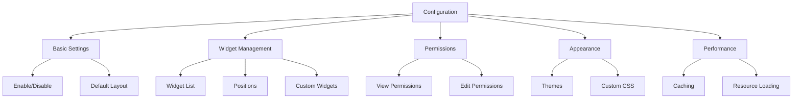

# IslamDashboard Configuration



This document provides a comprehensive guide to configuring the IslamDashboard extension. It covers all available settings, their default values, and recommended configurations for different use cases.

## Table of Contents

- [Basic Configuration](#basic-configuration)
- [Widget Configuration](#widget-configuration)
- [Permissions](#permissions)
- [Customization](#customization)
- [Performance Tuning](#performance-tuning)
- [Troubleshooting](#troubleshooting)
- [Advanced Configuration](#advanced-configuration)

## Basic Configuration

### Enabling the Dashboard

```php
// Enable or disable the entire dashboard
// Type: boolean
// Default: true
$wgIslamDashboardEnable = true;

// Set the default dashboard layout
// Options: 'default', 'compact', 'spacious', 'custom'
// Default: 'default'
$wgIslamDashboardDefaultLayout = 'default';
```

### User Interface

```php
// Show the dashboard link in the user menu
// Type: boolean
// Default: true
$wgIslamDashboardShowInUserMenu = true;

// Show the dashboard to anonymous users
// Type: boolean
// Default: false
$wgIslamDashboardAllowAnonAccess = false;

// Default dashboard tab for new users
// Type: string
// Default: 'home'
$wgIslamDashboardDefaultTab = 'home';
```

### Analytics and Privacy

```php
// Enable analytics for the dashboard
// Type: boolean
// Default: false
$wgIslamDashboardEnableAnalytics = false;

// Track widget usage statistics
// Type: boolean
// Default: false
$wgIslamDashboardTrackWidgetUsage = false;

// Anonymize IP addresses in analytics
// Type: boolean
// Default: true
$wgIslamDashboardAnonymizeIP = true;
```

### Localization

```php
// Default language for the dashboard
// Uses wiki's content language if not set
// Type: string|null
// Example: 'en', 'ar', 'fr'
$wgIslamDashboardDefaultLanguage = null;

// Available languages for the dashboard
// Empty array means all available languages
// Type: array
// Example: ['en', 'ar', 'fr']
$wgIslamDashboardAvailableLanguages = [];
```

## Widget Configuration

### Widget Management

```php
// Enable or disable specific widgets
// Type: array
// Format: 'widget-id' => boolean
$wgIslamDashboardWidgets = [
    'welcome' => true,          // Welcome message and quick stats
    'recent-activity' => true,  // Recent changes and edits
    'quick-actions' => true,    // Common action shortcuts
    'notifications' => true,    // User notifications
    'quick-links' => true,      // Customizable quick links
    'recent-files' => false,    // Recently uploaded files
    'watchlist' => true,        // Watchlist summary
    'contributions' => true     // User contributions
];

// Default widget positions and layout
// Type: array
$wgIslamDashboardDefaultWidgetPositions = [
    'main' => [
        'welcome',
        'recent-activity',
        'contributions'
    ],
    'sidebar' => [
        'quick-actions',
        'notifications',
        'quick-links',
        'watchlist'
    ]
];
```

### Widget Settings

```php
// Maximum number of items to show in activity feeds
// Type: integer
// Default: 10
$wgIslamDashboardMaxActivityItems = 10;

// Enable/disable widget customization for users
// Type: boolean
// Default: true
$wgIslamDashboardAllowWidgetCustomization = true;

// Allow users to add custom widgets
// Type: boolean
// Default: false
$wgIslamDashboardAllowCustomWidgets = false;

// Maximum number of custom widgets per user
// Type: integer
// Default: 5
$wgIslamDashboardMaxCustomWidgets = 5;

// Cache duration for widget data (in seconds)
// Type: integer
// Default: 300 (5 minutes)
$wgIslamDashboardWidgetCacheTTL = 300;
```

### Widget Refresh

```php
// Enable auto-refresh for widgets
// Type: boolean
// Default: true
$wgIslamDashboardEnableAutoRefresh = true;

// Default refresh interval in seconds
// Type: integer
// Default: 60
$wgIslamDashboardRefreshInterval = 60;

// Maximum number of concurrent widget updates
// Type: integer
// Default: 3
$wgIslamDashboardMaxConcurrentUpdates = 3;
```

## Permissions

### Access Control

```php
// Permission required to view the dashboard
// Type: string|array
// Default: 'read' (all logged-in users)
$wgIslamDashboardViewPermission = 'read';

// Permission required to customize the dashboard
// Type: string|array
// Default: 'editmyoptions' (users with preferences edit access)
$wgIslamDashboardCustomizePermission = 'editmyoptions';

// Permission required to view all users' dashboards (for admins)
// Type: string|array
// Default: 'viewdashboard-all' (no one by default)
$wgIslamDashboardViewAllPermission = 'viewdashboard-all';

// Permission required to manage dashboard settings
// Type: string|array
// Default: 'siteadmin'
$wgIslamDashboardManagePermission = 'siteadmin';

// Permission required to create custom widgets
// Type: string|array
// Default: 'editinterface'
$wgIslamDashboardCreateWidgetsPermission = 'editinterface';
```

### Group-based Permissions

```php
// Group-specific widget permissions
// Type: array
// Format: 'widget-id' => ['group1', 'group2']
$wgIslamDashboardWidgetGroupPermissions = [
    'admin-dashboard' => ['sysop', 'bureaucrat'],
    'moderation-tools' => ['sysop', 'moderator']
];

// Group-specific dashboard tabs
// Type: array
// Format: 'tab-id' => ['group1', 'group2']
$wgIslamDashboardTabGroupPermissions = [
    'admin' => ['sysop', 'bureaucrat'],
    'analytics' => ['analyst', 'sysop']
];
```

## Customization

### Adding Custom Widgets

You can add custom widgets to the dashboard by implementing the `IslamDashboardGetWidgets` hook:

```php
// In your extension's setup file
$wgHooks['IslamDashboardGetWidgets'][] = function ( &$widgets ) {
    $widgets[] = [
        // Required: Unique identifier for the widget
        'id' => 'my-custom-widget',
        
        // Required: Widget title (can be a message key)
        'title' => wfMessage( 'myextension-custom-widget-title' )->text(),
        
        // Required: Widget description (can be a message key)
        'description' => wfMessage( 'myextension-custom-widget-desc' )->text(),
        
        // Required: Callback function or method
        'callback' => 'MyExtension::renderCustomWidget',
        
        // Optional: Default section to place the widget in
        // Options: 'main', 'sidebar', 'header', 'footer'
        'defaultSection' => 'main',
        
        // Optional: Whether the widget can be hidden by users
        'canHide' => true,
        
        // Optional: Whether the widget is enabled by default
        'enabled' => true,
        
        // Optional: Groups that can see this widget
        'groups' => ['user', 'sysop'],
        
        // Optional: Required permissions to see this widget
        'permissions' => ['edit'],
        
        // Optional: Additional CSS class for the widget
        'class' => 'my-custom-widget',
        
        // Optional: Scripts to load with the widget
        'scripts' => ['ext.myextension.widget.js'],
        
        // Optional: Styles to load with the widget
        'styles' => ['ext.myextension.widget.css'],
        
        // Optional: Cache duration in seconds (0 to disable)
        'cache' => 300,
        
        // Optional: Whether to refresh the widget automatically
        'refreshable' => true,
        
        // Optional: Default configuration values
        'config' => [
            'itemsPerPage' => 10,
            'showThumbnails' => true
        ],
        
        // Optional: Configuration schema for the widget
        'configSchema' => [
            'itemsPerPage' => [
                'type' => 'number',
                'min' => 1,
                'max' => 50,
                'default' => 10,
                'label' => wfMessage('myextension-config-itemsperpage')->text()
            ]
        ]
    ];
    return true;
};
```

### Theming and Styling

#### CSS Variables

You can customize the dashboard's appearance using CSS variables in your wiki's `MediaWiki:Common.css` or skin's stylesheet:

```css
/* Color Scheme */
:root {
    /* Primary colors */
    --color-primary: #36c;
    --color-primary--hover: #2a4b8d;
    --color-primary--active: #1e3b6c;
    
    /* Background colors */
    --background-color-base: #fff;
    --background-color-muted: #f8f9fa;
    --background-color-input: #fff;
    
    /* Text colors */
    --color-text: #202122;
    --color-text-muted: #54595d;
    --color-text-light: #72777d;
    
    /* Border colors */
    --border-color-base: #a2a9b1;
    --border-color-muted: #c8ccd1;
    --border-color-subtle: #eaecf0;
    
    /* State colors */
    --color-success: #00af89;
    --color-warning: #ffcc33;
    --color-error: #d33;
    --color-info: #36c;
    
    /* Shadows */
    --box-shadow-card: 0 1px 3px rgba(0, 0, 0, 0.1);
    --box-shadow-dropdown: 0 2px 5px rgba(0, 0, 0, 0.15);
    
    /* Transitions */
    --transition-duration: 0.2s;
    --transition-timing: ease-in-out;
}

/* Dark mode support */
@media (prefers-color-scheme: dark) {
    :root {
        --background-color-base: #202122;
        --background-color-muted: #2a2d2f;
        --color-text: #f8f9fa;
        --color-text-muted: #a2a9b1;
        --border-color-base: #54595d;
        --border-color-muted: #3a3f42;
    }
}
```

#### Custom Widget Styling

```css
/* Example: Custom widget styling */
.dashboard-widget.my-custom-widget {
    /* Add a colored accent border */
    border-left: 3px solid var(--color-primary);
    
    /* Add some spacing */
    margin-bottom: 1.5rem;
    
    /* Smooth transitions */
    transition: box-shadow var(--transition-duration) var(--transition-timing);
}

/* Hover effect */
.dashboard-widget.my-custom-widget:hover {
    box-shadow: var(--box-shadow-card);
}

/* Widget header */
.dashboard-widget.my-custom-widget .widget-header {
    display: flex;
    align-items: center;
    padding: 0.75rem 1rem;
    border-bottom: 1px solid var(--border-color-subtle);
}

/* Widget title */
.dashboard-widget.my-custom-widget .widget-title {
    margin: 0;
    font-size: 1rem;
    font-weight: 600;
    color: var(--color-text);
}

/* Widget content */
.dashboard-widget.my-custom-widget .widget-content {
    padding: 1rem;
}

/* Widget footer */
.dashboard-widget.my-custom-widget .widget-footer {
    padding: 0.5rem 1rem;
    border-top: 1px solid var(--border-color-subtle);
    font-size: 0.875rem;
    color: var(--color-text-muted);
}

/* Custom widget elements */
.my-custom-widget-item {
    padding: 0.5rem 0;
    border-bottom: 1px dashed var(--border-color-subtle);
}

.my-custom-widget-item:last-child {
    border-bottom: none;
}

/* Responsive adjustments */
@media screen and (max-width: 768px) {
    .dashboard-widget.my-custom-widget {
        margin-bottom: 1rem;
    }
    
    .dashboard-widget.my-custom-widget .widget-content {
        padding: 0.75rem;
    }
}
```

### Custom Templates

You can override default templates by placing your custom Mustache templates in the `templates/` directory with the same filename as the original template.

## Performance Tuning

### Caching

```php
// Enable widget output caching
// Type: boolean
// Default: true
$wgIslamDashboardEnableCaching = true;

// Cache duration for widget data (in seconds)
// Type: integer
// Default: 300 (5 minutes)
$wgIslamDashboardCacheDuration = 300;

// Cache version (increment to force cache refresh)
// Type: integer
// Default: 1
$wgIslamDashboardCacheVersion = 1;

// Enable client-side caching
// Type: boolean
// Default: true
$wgIslamDashboardEnableClientCache = true;
```

### Resource Loading

```php
// Load resources on demand
// Type: boolean
// Default: true
$wgIslamDashboardLoadOnDemand = true;

// Combine and minify CSS/JS
// Type: boolean
// Default: true in production
$wgIslamDashboardMinifyResources = true;

// Load non-critical CSS asynchronously
// Type: boolean
// Default: true
$wgIslamDashboardLoadCSSAsync = true;

// Defer non-critical JavaScript
// Type: boolean
// Default: true
$wgIslamDashboardDeferJS = true;
```

## Advanced Configuration

### Database

```php
// Database table prefix for the dashboard
// Type: string
// Default: 'idash_'
$wgIslamDashboardDBPrefix = 'idash_';

// Use separate database for dashboard tables
// Type: string|false
// Default: false
$wgIslamDashboardDBName = false;

// Database server for dashboard tables
// Type: string|false
// Default: false (use main database server)
$wgIslamDashboardDBServer = false;
```

### Logging

```php
// Enable debug logging
// Type: boolean
// Default: false
$wgIslamDashboardDebug = false;

// Log widget loading times
// Type: boolean
// Default: false
$wgIslamDashboardLogPerformance = false;

// Log widget errors
// Type: boolean
// Default: true
$wgIslamDashboardLogErrors = true;
```

### API

```php
// Enable dashboard API
// Type: boolean
// Default: true
$wgIslamDashboardEnableAPI = true;

// API request timeout in seconds
// Type: integer
// Default: 30
$wgIslamDashboardAPITimeout = 30;

// Maximum number of items per API request
// Type: integer
// Default: 50
$wgIslamDashboardAPIMaxItems = 50;
```

## Troubleshooting

### Common Issues

#### Dashboard Not Appearing

1. **Check Installation**:
   ```php
   // Verify in LocalSettings.php
   wfLoadExtension( 'IslamDashboard' );
   ```

2. **Check Permissions**:
   ```php
   // In LocalSettings.php
   $wgIslamDashboardViewPermission = 'read'; // Default
   ```

3. **Check Skin Compatibility**:
   - Ensure your skin is compatible with the dashboard
   - Check browser console for JavaScript errors

#### Widgets Not Loading

1. **Check Browser Console**:
   - Open developer tools (F12)
   - Look for JavaScript errors
   - Check Network tab for failed requests

2. **Check Server Logs**:
   - Review PHP error log
   - Check MediaWiki debug log

3. **Verify Widget Registration**:
   ```php
   // In your extension setup
   $wgHooks['IslamDashboardGetWidgets'][] = 'MyExtension::onGetWidgets';
   ```

### Debugging Tools

#### Server-side Debugging

```php
// Enable debug mode
$wgDebugLogFile = '/path/to/debug.log';
$wgDebugToolbar = true;
$wgShowDebug = true;
$wgShowSQLErrors = true;
$wgDebugDumpSql = true;
```

#### Client-side Debugging

```javascript
// In your browser's console
dashboard = mw.loader.require('ext.islamDashboard');
console.log('Dashboard version:', dashboard.version);
console.log('Widgets:', dashboard.widgets);
```

## Support and Resources

### Documentation
- [Official Documentation](https://www.mediawiki.org/wiki/Extension:IslamDashboard)
- [API Reference](https://www.mediawiki.org/wiki/Extension:IslamDashboard/API)
- [Widget Development Guide](https://www.mediawiki.org/wiki/Extension:IslamDashboard/Widgets)

### Support Channels
- [Support Forum](https://www.mediawiki.org/wiki/Extension_talk:IslamDashboard)
- [Issue Tracker](https://github.com/muslim-wiki/IslamDashboard/issues)
- [Developer Chat](https://web.libera.chat/#mediawiki)

### Additional Resources
- [Extension Page](https://www.mediawiki.org/wiki/Extension:IslamDashboard)
- [GitHub Repository](https://github.com/muslim-wiki/IslamDashboard)
- [Release Notes](https://www.mediawiki.org/wiki/Extension:IslamDashboard/Release_notes)

## Contributing

We welcome contributions! Please see our [contributing guidelines](CONTRIBUTING.md) for more information.

## License

This extension is available under the [GNU General Public License 3.0 or later](https://www.gnu.org/licenses/gpl-3.0.html).
