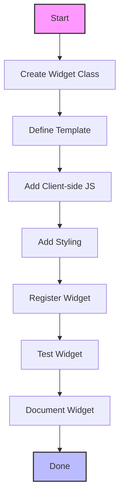

# Widget Development Guide - IslamDashboard



## Table of Contents

## Table of Contents
- [Overview](#overview)
- [Widget Architecture](#widget-architecture)
  - [Server-side Components](#server-side-components)
  - [Client-side Components](#client-side-components)
- [Creating a New Widget](#creating-a-new-widget)
  - [1. Server-side Implementation](#1-server-side-implementation)
  - [2. Client-side Implementation](#2-client-side-implementation)
  - [3. Styling](#3-styling)
  - [4. Templates](#4-templates)
- [Widget Configuration](#widget-configuration)
  - [Configuration Schema](#configuration-schema)
  - [Accessing Configuration](#accessing-configuration)
  - [Widget Permissions](#widget-permissions)
- [Widget Lifecycle](#widget-lifecycle)
  - [Initialization](#initialization)
  - [Rendering](#rendering)
  - [Updates](#updates)
- [Advanced Features](#advanced-features)
  - [Widget Refresh](#widget-refresh)
  - [Widget Interactions](#widget-interactions)
  - [Widget Events](#widget-events)
- [Best Practices](#best-practices)
  - [Performance](#performance)
  - [Accessibility](#accessibility)
  - [Internationalization](#internationalization)
  - [Security](#security)
- [Debugging Widgets](#debugging-widgets)
  - [Common Issues](#common-issues)
  - [Debugging Tools](#debugging-tools)
- [Example Widgets](#example-widgets)
- [Contributing](#contributing)
- [License](#license)

## Overview

Widgets are the core building blocks of the IslamDashboard, allowing users to customize their dashboard experience. This guide explains how to create, customize, and manage widgets effectively.

## Widget Architecture

### Server-side Components

1. **Widget Class**: Extends `DashboardWidget` and handles server-side logic
2. **Templates**: Define the widget's HTML structure using Mustache
3. **Configuration**: Defines configurable options and their schemas
4. **Permissions**: Controls widget visibility and access

### Client-side Components

1. **JavaScript Module**: Handles client-side interactivity
2. **Styles**: CSS/LESS for widget appearance
3. **Templates**: Client-side rendering with Mustache
4. **API Integration**: Fetches and updates data asynchronously

## Creating a New Widget

### 1. Server-side Implementation

#### Step 1: Create the Widget Class

Create a new PHP class that extends `DashboardWidget` in `includes/Widgets/`:

```php
<?php
namespace MediaWiki\Extension\IslamDashboard\Widgets;

use MediaWiki\Extension\IslamDashboard\Widgets\DashboardWidget;
use Html;
use Message;
use MediaWiki\MediaWikiServices;

/**
 * ExampleWidget - A sample widget demonstrating widget development
 * 
 * This widget shows how to create a custom widget with configuration options,
 * data fetching, and template rendering.
 */
class ExampleWidget extends DashboardWidget {
    /**
     * Default configuration values
     * @var array
     */
    protected $defaultConfig = [
        'title' => '',
        'limit' => 5,
        'showThumbnails' => true,
        'refreshInterval' => 300 // 5 minutes
    ];

    /**
     * Get the widget's unique identifier
     * @return string
     */
    public static function getType(): string {
        return 'example-widget';
    }

    // ... rest of the class implementation ...
}
```

#### Step 2: Implement Required Methods

```php
/**
 * Get the widget's display name
 * @return Message
 */
public function getName(): Message {
    return $this->msg('examplewidget-name');
}

/**
 * Get the widget's description
 * @return Message
 */
public function getDescription(): Message {
    return $this->msg('examplewidget-desc');
}
```

#### Step 3: Implement Content Generation

```php
/**
 * Get the widget's HTML content
 * @return string
 */
public function getContent(): string {
    $data = [
        'title' => $this->getConfigValue('title', $this->getName()->text()),
        'items' => $this->fetchData(),
        'config' => $this->config
    ];
    
    return $this->renderTemplate('ExampleWidget', $data);
}

/**
 * Fetch widget data
 * @return array
 */
protected function fetchData(): array {
    $limit = (int)$this->getConfigValue('limit', 5);
    // Example data fetching logic
    return [
        ['id' => 1, 'title' => 'Example Item 1'],
        ['id' => 2, 'title' => 'Example Item 2']
    ];
}
```
<?php
namespace MediaWiki\Extension\IslamDashboard\Widgets;

use MediaWiki\Extension\IslamDashboard\Widgets\DashboardWidget;
use Html;
use Message;
use MediaWiki\MediaWikiServices;

/**
 * My Custom Widget
 * 
 * This widget demonstrates how to create a custom widget for the IslamDashboard.
 * It shows example content and can be configured through the widget settings.
 */
class MyCustomWidget extends DashboardWidget {
    /**
     * @var array Default configuration values
     */
    protected $defaultConfig = [
        'title' => '',
        'limit' => 10,
        'showHeader' => true
    ];
    
    /**
     * @var array Cached widget data
     */
    protected $cachedData = null;
    /**
     * Get the widget's unique identifier
     * 
     * This identifier is used to reference the widget in the database and URLs.
     * It should be unique across all widgets and contain only lowercase letters, numbers, and hyphens.
     * 
     * @return string Widget type identifier (e.g., 'recent-changes', 'user-contributions')
     */
    public static function getType(): string {
        return 'my-custom-widget';
    }

    /**
     * Get the widget's display name
     * 
     * The name is displayed in the widget header and in the widget selector.
     * It should be a short, descriptive name that clearly indicates the widget's purpose.
     * 
     * @return Message Localized widget name
     */
    public function getName(): Message {
        return $this->msg('mycustomwidget-name');
    }

    /**
     * Get the widget's description
     * 
     * The description is shown in the widget selector and should provide
     * a brief explanation of what the widget does.
     * 
     * @return Message Localized widget description
     */
    public function getDescription(): Message {
        return $this->msg('mycustomwidget-desc');
    }

    /**
     * Get the widget's icon
     * 
     * The icon is displayed in the widget header and in the widget selector.
     * It should be a FontAwesome icon class (e.g., 'fa-star', 'fa-list').
     * 
     * @return string FontAwesome icon class
     */
    public function getIcon(): string {
        return 'fa-star';
    }

    /**
     * Get the widget's content
     * 
     * This method generates the HTML content of the widget. It's called when the widget
     * is rendered on the dashboard.
     * 
     * @return string HTML content of the widget
     */
    public function getContent(): string {
        // Get configuration values with defaults
        $title = $this->getConfigValue('title', $this->getName()->text());
        $showHeader = $this->getConfigValue('showHeader', true);
        
        // Prepare data for the template
        $data = [
            'title' => $title,
            'showHeader' => $showHeader,
            'content' => $this->fetchContent(),
            'emptyMessage' => $this->msg('mycustomwidget-empty')->text(),
            'timestamp' => wfTimestampNow()
        ];
        
        // Render the template with the data
        return $this->renderTemplate('MyWidget', $data);
    }
    
    /**
     * Fetch widget content data
     * 
     * This method retrieves the data needed to render the widget.
     * It can make database queries, API calls, or other operations.
     * 
     * @return array Data to be passed to the template
     */
    protected function fetchContent(): array {
        // Use cached data if available
        if ($this->cachedData !== null) {
            return $this->cachedData;
        }
        
        $limit = (int)$this->getConfigValue('limit', 10);
        
        // Example: Fetch recent changes
        $dbr = wfGetDB(DB_REPLICA);
        $res = $dbr->select(
            'recentchanges',
            ['rc_title', 'rc_timestamp', 'rc_user_text'],
            [],
            __METHOD__,
            [
                'ORDER BY' => 'rc_timestamp DESC',
                'LIMIT' => $limit
            ]
        );
        
        $items = [];
        foreach ($res as $row) {
            $items[] = [
                'title' => $row->rc_title,
                'timestamp' => $row->rc_timestamp,
                'user' => $row->rc_user_text,
                'url' => Title::newFromText($row->rc_title)->getLocalURL()
            ];
        }
        
        // Cache the results
        $this->cachedData = [
            'items' => $items,
            'count' => count($items),
            'hasMore' => count($items) >= $limit
        ];
        
        return $this->cachedData;
    }

    /**
     * Get the widget's CSS class
     * 
     * This class is added to the widget's container element.
     * It should be unique to the widget to avoid CSS conflicts.
     * 
     * @return string CSS class name
     */
    public function getCssClass(): string {
        return 'ext-islamdashboard-widget-my-custom';
    }

    /**
     * Get the widget's JavaScript modules
     * 
     * These modules are loaded when the widget is rendered.
     * They should be registered in extension.json.
     * 
     * @return array List of module names
     */
    public function getModules(): array {
        return [
            'ext.islamDashboard.myCustomWidget',
            'ext.islamDashboard.common' // Shared module
        ];
    }

    /**
     * Get the widget's styles
     * 
     * These styles are loaded when the widget is rendered.
     * They should be registered in extension.json.
     * 
     * @return array List of style module names
     */
    public function getStyles(): array {
        return [
            'ext.islamDashboard.myCustomWidget.styles',
            'ext.islamDashboard.common.styles' // Shared styles
        ];
    }

    /**
     * Get the widget's configuration schema
     * 
     * Defines the configurable options for the widget.
     * Each option can have the following properties:
     * - type: Input type (text, number, boolean, select, etc.)
     * - label: Display label (Message key or string)
     * - default: Default value
     * - required: Whether the field is required
     * - options: For select fields, an array of value => label pairs
     * - min/max: For number fields, the minimum/maximum value
     * - help: Help text (Message key or string)
     * 
     * @return array Configuration schema
     */
    public function getConfigSchema(): array {
        return [
            'title' => [
                'type' => 'text',
                'label' => $this->msg('mycustomwidget-config-title')->text(),
                'default' => $this->getName()->text(),
                'required' => true,
                'help' => $this->msg('mycustomwidget-config-title-help')->text()
            ],
            'limit' => [
                'type' => 'number',
                'label' => $this->msg('mycustomwidget-config-limit')->text(),
                'default' => 10,
                'min' => 1,
                'max' => 100,
                'help' => $this->msg('mycustomwidget-config-limit-help')->text()
            ],
            'showHeader' => [
                'type' => 'boolean',
                'label' => $this->msg('mycustomwidget-config-showheader')->text(),
                'default' => true,
                'help' => $this->msg('mycustomwidget-config-showheader-help')->text()
            ],
            'displayMode' => [
                'type' => 'select',
                'label' => $this->msg('mycustomwidget-config-displaymode')->text(),
                'default' => 'list',
                'options' => [
                    'list' => $this->msg('mycustomwidget-displaymode-list')->text(),
                    'grid' => $this->msg('mycustomwidget-displaymode-grid')->text(),
                    'cards' => $this->msg('mycustomwidget-displaymode-cards')->text()
                ],
                'help' => $this->msg('mycustomwidget-config-displaymode-help')->text()
            ]
        ];
    }
    
    /**
     * Check if the current user can see this widget
     * 
     * Override this method to implement custom permission logic.
     * 
     * @return bool Whether the widget should be visible
     */
    public function isVisible(): bool {
        // Default implementation checks if the widget is enabled
        if (!parent::isVisible()) {
            return false;
        }
        
        // Add custom visibility logic here
        $user = $this->getUser();
        return $user->isAllowed('view-mycustomwidget');
    }
    
    /**
     * Called when the widget's configuration is saved
     * 
     * Override this method to perform any actions when the widget's
     * configuration is saved (e.g., clear caches).
     * 
     * @param array $newConfig New configuration values
     * @param array $oldConfig Previous configuration values
     */
    public function onConfigSave(array $newConfig, array $oldConfig): void {
        // Clear cached data when configuration changes
        if ($newConfig['limit'] !== ($oldConfig['limit'] ?? null)) {
            $this->clearCache();
        }
    }
    
    /**
     * Clear the widget's cache
     */
    public function clearCache(): void {
        $this->cachedData = null;
        // Optionally clear any persistent cache here
    }
}
```

### 2. Template File

Create a Mustache template in `templates/`:

```html
<!-- templates/ExampleWidget.mustache -->
<div class="example-widget">
    <h3 class="widget-title">{{title}}</h3>
    <div class="widget-content">
        {{#items}}
        <div class="widget-item">
            {{#showThumbnails}}
            <div class="item-thumbnail">
                
            </div>
            {{/showThumbnails}}
            <div class="item-content">
                <h4>{{title}}</h4>
                <p>{{description}}</p>
            </div>
        </div>
        {{/items}}
        {{^items}}
        <div class="widget-empty">
            {{msg-empty}}
        </div>
        {{/items}}
    </div>
</div>
```

### 3. Client-side Implementation

Create a JavaScript file in `resources/widgets/`:

```javascript
// resources/widgets/ext.islamDashboard.widgets.exampleWidget.js
( function ( $, mw ) {
    'use strict';

    /**
     * Initialize the ExampleWidget
     */
    function initExampleWidget( $container ) {
        // Widget initialization code
        $container.on('click', '.widget-item', function() {
            // Handle item click
            console.log('Item clicked');
        });

        // Set up auto-refresh if enabled
        var refreshInterval = $container.data('refresh-interval');
        if (refreshInterval) {
            setInterval(function() {
                refreshWidget($container);
            }, refreshInterval * 1000);
        }
    }

    /**
     * Refresh widget content
     */
    function refreshWidget($container) {
        var widgetId = $container.attr('id');
        
        // Show loading state
        $container.addClass('loading');
        
        // Fetch updated content
        new mw.Api().get({
            action: 'islamdashboard-get-widget-content',
            widget: widgetId
        }).done(function(data) {
            // Update widget content
            $container.html(data.html);
            // Re-initialize any widgets within the content
            mw.hook('wikipage.content').fire($container);
        }).always(function() {
            $container.removeClass('loading');
        });
    }

    // Register widget initialization
    mw.hook('islamdashboard.widgets').add(function(widgets) {
        widgets.register('example-widget', initExampleWidget);
    });

}( jQuery, mediaWiki ));
```

Create a template file in `templates/widgets/MyCustomWidget.mustache`:

```html
<div class="widget my-custom-widget">
    <div class="widget-header">
        <h3 class="widget-title">
            <i class="fa {{icon}}"></i>
            {{title}}
        </h3>
        <div class="widget-actions">
            <button class="widget-refresh" title="Refresh">
                <i class="fa fa-sync-alt"></i>
            </button>
            <button class="widget-configure" title="Configure">
                <i class="fa fa-cog"></i>
            </button>
        </div>
    </div>
    <div class="widget-content">
        <p>{{content}}</p>
        {{#settings.setting2}}
        <div class="setting-enabled">
            Setting 2 is enabled!
        </div>
        {{/settings.setting2}}
    </div>
</div>
```

### 3. JavaScript Module

Create a JavaScript module in `resources/widgets/my-custom-widget.js`:

```javascript
/**
 * My Custom Widget JavaScript
 */
( function ( $, mw ) {
    'use strict';
    
    function init( $container ) {
        // Initialize widget
        $container.on('click', '.widget-refresh', function() {
            refreshWidget($container);
        });
        
        // Load initial data
        loadWidgetData($container);
    }
    
    function refreshWidget($container) {
        $container.addClass('loading');
        
        // Make API request to refresh widget data
        return new mw.Api().get({
            action: 'islamdashboard',
            submodule: 'myCustomWidget',
            format: 'json'
        })
        .done(function(data) {
            // Update widget content
            $container.find('.widget-content').html(data.html);
        })
        .always(function() {
            $container.removeClass('loading');
        });
    }
    
    function loadWidgetData($container) {
        // Load initial data
        refreshWidget($container);
    }
    
    // Register widget
    mw.hook('islamdashboard.widgets').add(function(widgets) {
        widgets.register('my-custom-widget', {
            init: init,
            refresh: refreshWidget
        });
    });
    
}( jQuery, mediaWiki ) );
```

### 4. Styles

Create a Less file in `resources/styles/widgets/my-custom-widget.less`:

```less
.my-custom-widget {
    border: 1px solid #e0e0e0;
    border-radius: 4px;
    background: #fff;
    margin-bottom: 1rem;
    
    .widget-header {
        display: flex;
        justify-content: space-between;
        align-items: center;
        padding: 0.75rem 1rem;
        border-bottom: 1px solid #e0e0e0;
        
        .widget-title {
            margin: 0;
            font-size: 1rem;
            font-weight: 600;
            
            .fa {
                margin-right: 0.5rem;
                color: #36c;
            }
        }
        
        .widget-actions {
            button {
                background: none;
                border: none;
                color: #72777d;
                cursor: pointer;
                padding: 0.25rem 0.5rem;
                margin-left: 0.25rem;
                border-radius: 2px;
                
                &:hover {
                    background-color: #f8f9fa;
                    color: #36c;
                }
            }
        }
    }
    
    .widget-content {
        padding: 1rem;
        
        .setting-enabled {
            margin-top: 1rem;
            padding: 0.5rem;
            background-color: #e6f3ff;
            border-radius: 3px;
            color: #36c;
        }
    }
    
    &.loading {
        opacity: 0.7;
        position: relative;
        
        &::after {
            content: '';
            position: absolute;
            top: 0;
            left: 0;
            right: 0;
            bottom: 0;
            background: rgba(255, 255, 255, 0.7) url(../images/loading.gif) no-repeat center;
            z-index: 10;
        }
    }
}
```

## Widget Registration

### 1. Class Registration
Register your widget class in `extension.json`:

```json
"AutoloadClasses": {
    "MediaWiki\\Extension\\IslamDashboard\\Widgets\\MyCustomWidget": "includes/Widgets/MyCustomWidget.php"
}
```

### 2. Widget Registration
Register the widget in your extension's hooks:

```php
public static function onExtensionRegistration() {
    WidgetManager::getInstance()->registerWidget(MyCustomWidget::class);
}
```

## Widget Properties

### Required Methods
- `getType()`: Unique identifier for the widget
- `getName()`: Display name
- `getDescription()`: Short description
- `render()`: Renders the widget content

### Optional Methods
- `getIcon()`: Returns an OOUI icon name
- `isEditable()`: Whether the widget can be edited
- `canBeAdded()`: Whether the widget can be added by users
- `getDefaultConfig()`: Default configuration

## Widget Styling

### CSS Guidelines
- Use BEM naming convention
- Scope styles to widget class
- Use Codex design tokens

Example:
```css
.my-custom-widget {
    padding: var(--space-2);
}

.my-custom-widget__header {
class ExampleWidget extends DashboardWidget {
    public static function getType() {
        return 'example-widget';
    }

    public function getName() {
        return wfMessage('examplewidget-name');
    }

    public function getDescription() {
        return wfMessage('examplewidget-desc');
    }

    public function getIcon() {
        return 'puzzle';
    }

    public function render() {
        $out = Html::element('h3', ['class' => 'example-widget__header'], 'Example Widget');
        $out .= Html::element('div', ['class' => 'example-widget__content'], 'This is an example widget.');
        return $out;
    }
}
```

## Widget Templates

### Basic Structure
```html
<div class="widget widget--{type}">
    <header class="widget__header">
        <h3 class="widget__title">{title}</h3>
        {controls}
    </header>
    <div class="widget__content">
        {content}
    </div>
</div>
```

## Testing Widgets

### Unit Tests
- Test widget rendering
- Test configuration handling
- Test permissions

### Browser Tests
- Test responsive behavior
- Test interactions
- Test accessibility

## Troubleshooting

### Common Issues
1. **Widget not appearing**: Check browser console for errors
2. **Styling issues**: Verify CSS class names and specificity
3. **JavaScript errors**: Check for conflicts with other scripts

## See Also
- [API Reference](./API_REFERENCE.md)
- [Configuration Guide](./CONFIGURATION.md)
